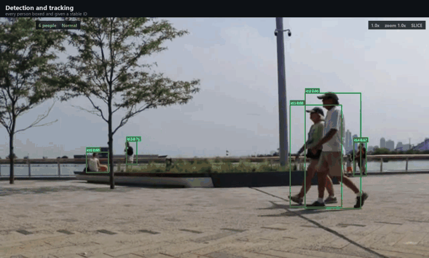
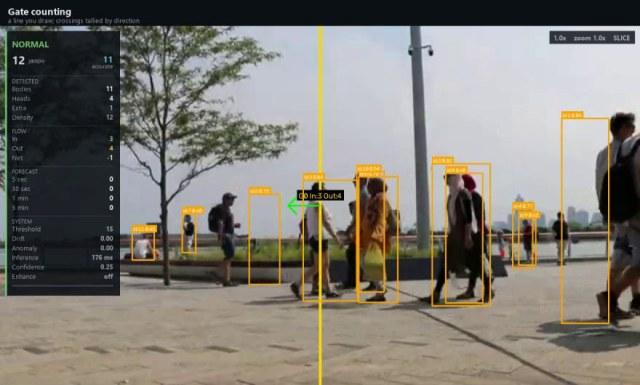
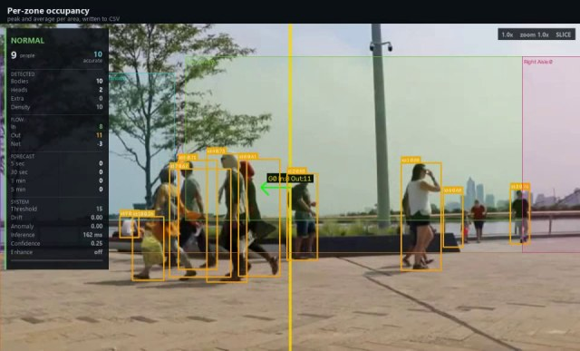
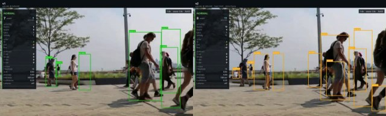

<h1 align="center">Crowd Master</h1>

<p align="center">
  <b>Real-time crowd analytics for CCTV</b><br>
  Detection · tracking · doorway counting · zone occupancy · anomaly clips · forecasting
</p>

<p align="center">
  
  
  
  
  
  
</p>

<p align="center">
  
</p>

<p align="center">
  <sub>One pass over real CCTV footage. Every number on screen is produced live by the pipeline.</sub>
</p>

---

<table>
<tr>
<td width="25%" align="center"><h3>43–72 ms</h3><sub>per frame<br>laptop RTX 3050</sub></td>
<td width="25%" align="center"><h3>~20 /s</h3><sub>detections<br>960×540, FP16</sub></td>
<td width="25%" align="center"><h3>11 s</h3><sub>launch to first<br>detection</sub></td>
<td width="25%" align="center"><h3>28</h3><sub>defects found,<br>documented, fixed</sub></td>
</tr>
</table>

Every figure above was measured on the hardware named beside it, not estimated.
`AUDIT.md` records how each one was reproduced.

---

## What it does

| | |
|---|---|
| **Counts people** | Body detection fused with pose-derived head positions, so partly occluded people still register. |
| **Counts through doorways** | Draw a line on the video; crossings are tallied by direction and saved between runs. |
| **Tracks named zones** | Peak, average and busiest moment per area — written to CSV and the session report, so "how full was the hall at 18:30" is answerable afterwards. |
| **Flags anomalies** | Density surges, rapid evacuation and unusual motion from optical flow, **with the surrounding video clip saved automatically**. |
| **Forecasts occupancy** | 5 s to 5 min ahead from a robust trend fit over a 1 Hz history. |
| **Serves it live** | Small REST API, plus a TXT/PDF session report and a CSV time series. |
| **Runs anywhere** | Video file, webcam or RTSP camera. Windowed or fully headless for batch jobs. |

<details>
<summary><b>Architecture</b></summary>

```
             ┌──────────────────┐
  camera ───▶│ VideoPlayer      │  exact-FPS playback, independent of detection
  or file    └────────┬─────────┘
                      │
             ┌────────▼─────────┐
             │ DetectionWorker  │  YOLOv8 body + pose, ByteTrack, fusion,
             │                  │  gate crossings, optional sliced inference
             └────────┬─────────┘
                      │  shared snapshot
       ┌──────────────┼──────────────┐
       │              │              │
┌──────▼──────┐ ┌─────▼──────┐ ┌─────▼──────┐
│ Analytics   │ │ Event      │ │ Main thread│
│ zones,      │ │ Recorder   │ │ HUD only,  │
│ forecast,   │ │ pre/post   │ │ never
│ anomaly,CSV │ │ roll clips │ │ blocks     │
└─────────────┘ └────────────┘ └────────────┘
```

The display thread only draws. Detection running slowly makes the overlay lag
behind the video; it never freezes the window.
</details>

---

## Testing

Three recordings of real runs, each a single unbroken pass over the same
promenade footage. Nothing is staged and no figure is edited in afterwards —
every number on screen is produced live by the pipeline as the clip plays,
including the ones that are unflattering.

<table>
<tr>
<td width="50%">
  <a href="docs/testing/01-full-walkthrough.mp4"></a>
  <p><b>Full walkthrough</b> · 40 s<br>
  <sub>Every capability in turn, captioned as it appears: detection and tracking,
  gate counting, per-zone occupancy, the density heatmap, and an anomaly with its
  clip saved. Closes on the actual report and CSV rows the run wrote out.</sub></p>
</td>
<td width="50%">
  <a href="docs/testing/02-short-overview.mp4"></a>
  <p><b>Short overview</b> · 20 s<br>
  <sub>The same run, condensed. Useful if you only want to see that the thing
  runs and what the readout looks like while it does.</sub></p>
</td>
</tr>
<tr>
<td colspan="2">
  <a href="docs/testing/03-before-after.mp4"></a>
  <p><b>Before and after</b> · 16 s<br>
  <sub>v1 on the left, v2 on the right, fed identical frames. The count differs
  because v1's non-maximum suppression discarded the weakest detection on every
  frame by construction — see <a href="AUDIT.md">AUDIT.md</a>.</sub></p>
</td>
</tr>
</table>

Recorded with `tools/make_demo.py`, which drives the same code path as a normal
run. To reproduce any of them:

```bash
venv\Scripts\python.exe tools\make_demo.py --showcase --video your_clip.mp4
```

## Honest limits

This project keeps its measurements in the open, including the unflattering ones.

> **Gate counting depends on tracker identity.** It is dependable when people
> cross one at a time or clearly separated — a doorway, a turnstile, a corridor.
> It is **not** dependable for dense two-way flow through a wide opening, because
> the count is only as good as the tracker's ability to keep one ID on one
> person. [Measured and explained below](#what-gate-counting-can-and-cannot-do).

> **Detection accuracy on real footage is unmeasured.** Every published figure
> here is a speed measurement. There is a harness for measuring accuracy
> ([below](#measuring-accuracy)); it needs frames counted by hand, and those do
> not exist yet.

## Version

**v2** — the system audited, measured and fixed. `AUDIT.md` records what was
broken, how each finding was reproduced, and what remains open. A few of those
findings came from writing the tests rather than from reading the code.

**v3, in progress** — watchlist identity matching (face / appearance
re-identification / gait), gated on whether a camera's pixels actually support
the method. Held back deliberately: it is written but not yet verified against a
measured false-accept rate, and it does not ship until it is. On the
`phase3-identity` branch.

---

## Quick start

```bash
python -m venv venv
venv\Scripts\python.exe -m pip install torch==2.11.0 torchvision==0.26.0 --index-url https://download.pytorch.org/whl/cu130
venv\Scripts\python.exe -m pip install -r requirements.txt
```

Then either double-click `run_crowd_master.cmd`, or:

```bash
venv\Scripts\python.exe crowd_master_v2.py
```

With no `CROWD_MASTER_VIDEO` set, a launcher window opens so you can browse for
a video or pick a camera.

## Keys

| Key | Action | Key | Action |
|-----|--------|-----|--------|
| `Q` | quit | `G` | gate draw mode (click + drag) |
| `P` | pause | `TAB` | select next gate |
| `N` | stats panel | `R` | reverse selected gate / reset view |
| `B` | boxes | `X` | delete selected gate / clear all |
| `H` | heads | `ESC` | deselect gate |
| `M` | heatmap | `S` | save snapshot |
| `Z` | zones | `V` / `C` | volume up / down |
| `F` | fullscreen | `+` / `-` | playback speed |
| `I` | image enhance | `]` / `[` | zoom |
| `T` | test-time augmentation | `W A D` + arrows | pan |
| `O` | detection on/off | `.` / `,` | seek ±5 s |
| `K` | controls overlay | `E` | export CNN to ONNX |
| `Ctrl+R` | trigger retrain | | |

Gates are saved to `DATA/gates.json` and reloaded automatically.

## Configuration

Everything is overridable by environment variable — no code edits needed.

| Variable | Default | Meaning |
|---|---|---|
| `CROWD_MASTER_VIDEO` | `test_video.mp4` | video file; skips the launcher |
| `CROWD_MASTER_INPUT_MODE` | `file` | `file` \| `webcam` \| `rtsp` |
| `CROWD_MASTER_CAMERA_INDEX` | `0` | webcam index |
| `CROWD_MASTER_CAMERA_URL` | — | RTSP URL |
| `CROWD_MASTER_DATA_DIR` | `./DATA` | all outputs, logs and reports |
| `CROWD_MASTER_DEVICE` | auto | `cuda` \| `cpu` |
| `CROWD_MASTER_FP16` | `1` | half precision on GPU |
| `CROWD_MASTER_BODY_MODEL` | `yolov8s.pt` | body detector weights |
| `CROWD_MASTER_HEAD_MODEL` | `yolov8s-pose.pt` | pose model used for heads |
| `CROWD_MASTER_TRACKER` | `bytetrack.yaml` | or `botsort.yaml` |
| `CROWD_MASTER_ONLINE_LEARNING` | `0` | see "Online learning" below |
| `CROWD_MASTER_LOG_EVERY_SEC` | `2` | CSV sampling interval |
| `CROWD_MASTER_CUDNN_BENCHMARK` | `0` | cuDNN autotune — see "Startup time" |
| `CROWD_MASTER_CONTROLS_SEC` | `12` | seconds before the controls panel auto-hides (0 = never) |
| `CROWD_MASTER_HUD_MIN_WIDTH` | `1280` | draw overlays at this width minimum (0 = off) |
| `CROWD_MASTER_SPEED_THRESH` | `30` | optical-flow magnitude that counts as running |
| `CROWD_MASTER_DENSITY_JUMP` | `8` | count jump that counts as a surge |
| `CROWD_MASTER_EVENT_CLIPS` | `1` | save a video clip around each anomaly |
| `CROWD_MASTER_EVENT_PRE` | `5` | seconds of footage kept *before* the trigger |
| `CROWD_MASTER_EVENT_POST` | `5` | seconds kept after |
| `CROWD_MASTER_EVENT_COOLDOWN` | `30` | minimum seconds between clips |
| `CROWD_MASTER_EVENT_WIDTH` | `960` | clips are downscaled to this width |
| `CROWD_MASTER_EVENT_BUFFER_MB` | `192` | cap on the pre-roll buffer |
| `CROWD_MASTER_HEADLESS` | `0` | no window, no key waits |
| `CROWD_MASTER_MAX_FRAMES` | `0` | stop after N frames (0 = unlimited) |
| `CROWD_MASTER_LOOP` | `1` (`0` headless) | loop the video at end |
| `CROWD_MASTER_API_HOST` | `127.0.0.1` | see "API" below |
| `CROWD_MASTER_API_PORT` | `5055` | |
| `CROWD_MASTER_API_KEY` | — | required to bind off-loopback |
| `CROWD_MASTER_API_ORIGINS` | — | comma-separated CORS origins |

### Model choice

On the RTX 3050 this project targets, `yolov8s` is **faster** than `yolov8n`
(18.6 ms vs 25.0 ms at 960×540 FP16) — the nano model is too small to keep the
GPU busy. `s` is therefore the default for both detectors.

### Startup time

Roughly 11 seconds from launch to the first detection, most of which is
importing torch/ultralytics and initialising the CUDA context — largely fixed
costs. Two things that used to make it far worse:

`torch.backends.cudnn.benchmark` is **off**. It autotunes convolution algorithms
per input shape, which only pays off when the shape never changes; ultralytics
letterboxes frames to varying sizes, so the search is repeated rather than
amortised. Measured over four alternating runs it cost about 20 seconds of
startup and made steady state no faster:

| | benchmark=False | benchmark=True |
|---|---|---|
| first inference | 9.0 / 18.4 s | 26.9 / 32.6 s |
| startup total | 31.6 / 41.7 s | 51.8 / 52.6 s |
| steady state | 79 / 134 ms | 82 / 149 ms |

The second detector used by sliced inference and TTA is loaded on first use
rather than at launch, since slicing only engages once a scene is dense.

Note the spread in those steady-state figures: the same binary measures 43 ms on
an idle machine and over 130 ms with a couple of busy background processes. Take
any single timing here as indicative, not exact.

### Zones

`Config.ZONES` maps a name to a rectangle in frame fractions `(x1, y1, x2, y2)`.
Occupancy per zone is written to `crowd_log.csv` as a `zone_*` column, summarised
in the session report (peak, average, busiest moment), and exposed on
`/api/status`. That is what turns "how many people are in frame" into "how full
was the hall at 18:30", which is usually the question worth asking.

Two zone names that differ only by case are counted as separate areas and are
indistinguishable in a report, so the tracker warns if it sees a pair.

### Event clips

When an anomaly fires, the seconds either side of it are written to
`DATA/events/` with an `events.csv` index. Frames are buffered in memory ahead of
the trigger, downscaled to `EVENT_WIDTH` and capped by `EVENT_BUFFER_MB`, so a
5-second pre-roll costs a bounded amount however large the camera's frames are —
at 1080p an uncapped buffer would be roughly 780 MB.

### Online learning

The CNN crowd regressor and its online trainer are **off by default**. Measured
on this hardware they cost 40–60% of the frame rate (20.0 FPS → 7.7–12.8 FPS)
while contributing a count of 0 in every logged session, because they train on
the detector's own output rather than on ground truth. Enable with
`CROWD_MASTER_ONLINE_LEARNING=1` if you want to work on them.

### API

`GET /api/status` returns live counts, gate totals, forecasts and anomalies;
`GET /api/health` is a liveness probe.

The server binds **loopback only** by default. To expose it on the network you
must set both `CROWD_MASTER_API_HOST` and `CROWD_MASTER_API_KEY` — it refuses to
start off-loopback without a key, and clients then send `X-API-Key`.

## Headless / batch

```bash
CROWD_MASTER_HEADLESS=1 CROWD_MASTER_MAX_FRAMES=400 \
CROWD_MASTER_VIDEO=clip.mp4 CROWD_MASTER_DATA_DIR=out \
venv/Scripts/python.exe crowd_master_v2.py
```

Runs with no window, stops on its own, and writes the CSV, TXT and PDF reports.

## Tests

```bash
venv/Scripts/python.exe tests/test_gate_counting.py
```

Generates clips with a known number of people crossing a known line. This is the
regression test for the v5.2 bug where enabling sliced inference silently zeroed
every gate count.

It runs two groups:

**Sequential crossings — asserted.** People cross one at a time, so identity is
unambiguous and the count must match exactly.

**Simultaneous crossings — reported only.** Several people crossing together at
the same speed is close to the worst case for a motion-only tracker: it swaps
their IDs, and gate counting is identity-based, so the total is not dependable.
Observed runs credit one ID with two crossings while missing another walker
outright. The number is printed rather than asserted, because it moves with
changes that have nothing to do with the gate — switching cuDNN autotuning off
was enough to flip it. A number far from the expectation is a hint to look at
tracker choice or re-identification, not evidence of a broken gate.

### What gate counting can and cannot do

It is dependable when people cross a line one at a time or clearly separated —
a doorway, a turnstile, a corridor. It is **not** dependable for dense two-way
flow through a wide opening, because the count is only as good as the tracker's
ability to keep one ID on one person. Fixing that properly means
re-identification (appearance features), not tuning thresholds.

## Measuring accuracy

Every other benchmark here measures speed. To find out whether the counts are
*right*, label some frames by hand and compare:

```bash
venv\Scripts\python.exe tools\extract_frames.py clip.mp4 --count 200
# fill in the count column of clip_labels/labels.csv
venv\Scripts\python.exe tests\measure_accuracy.py clip.mp4 clip_labels/labels.csv
```

It reports MAE, RMSE and bias for each figure the system produces (`bodies`,
`fused`, `smooth`, `accurate`), so you can see which to trust. Bias matters as
much as MAE: a system consistently 2 low is easy to correct, one scattering ±4 is
not. `--no-heads`, `--model` and `--infer-width` let you measure a change without
editing code — for instance whether the pose model earns its 17-34 ms.

Counting 200 frames takes about an hour, once. Until it exists, no change can be
judged on accuracy — only on speed.

## Outputs

Everything lands in `DATA/` (or `CROWD_MASTER_DATA_DIR`):

| File | Contents |
|---|---|
| `crowd_log.csv` | time series: counts, forecasts, anomaly and drift scores |
| `crowd_report.txt` | session report — peaks, crowded periods, gate totals |
| `crowd_report.pdf` | the same report, formatted |
| `crowd_master.log` | run log |
| `gates.json` | gate geometry, reloaded on next run |
| `drift_events.csv` | scene-drift events |
| `events/*.mp4` | clips saved around anomalies |
| `events/events.csv` | index of those clips |

## Project layout

| Path | What it is |
|---|---|
| `crowd_master_v2.py` | the whole application |
| `tests/test_gate_counting.py` | gate-counting regression test |
| `tests/measure_accuracy.py` | accuracy against hand-counted frames |
| `tools/extract_frames.py` | pulls frames out for hand-counting |
| `tools/make_demo.py` | records the clips in [Testing](#testing) |
| `docs/testing/` | those recordings, and their poster frames |
| `AUDIT.md` | code review: defects, measurements, what is outstanding |

## Notes

`AUDIT.md` records the 2026-09-04 review — what was broken, how each finding was
measured, and what is still open. Several fixes in it came from writing the
tests rather than from reading the code.

## License

MIT — see `LICENSE`.
